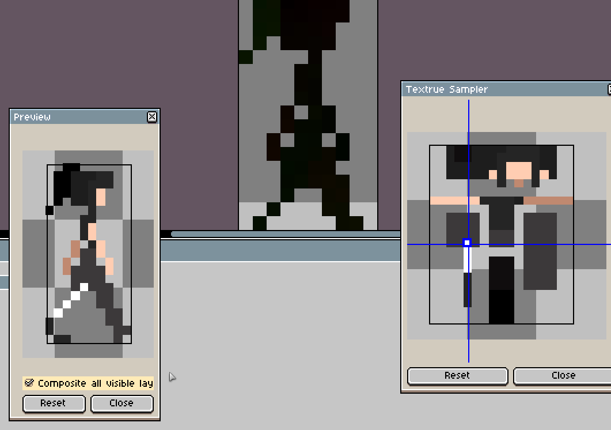
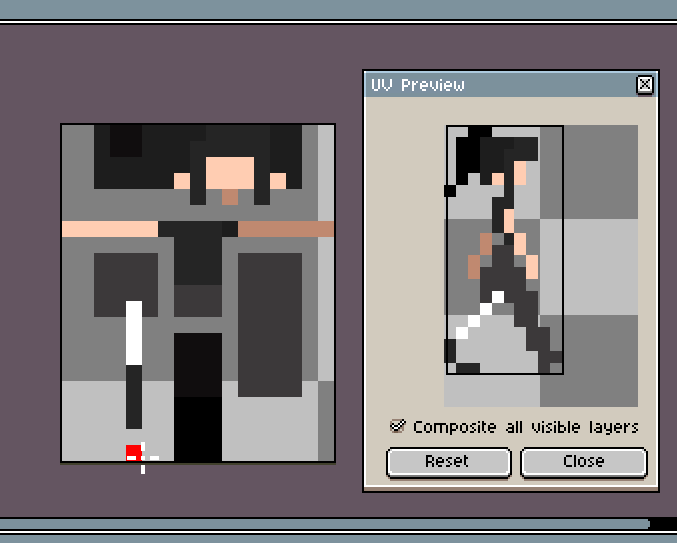

# Sprite Map Helper

## About
The following video gives a quick summary on the technique this plugin aims to help with: https://www.youtube.com/watch?v=HsOKwUwL1bE

## How to install

1. Select `Edit > Preferences` in aseprite.
2. Select the `Extensions` option on the left.
3. Click the `Add Extension` button and find the extension.
4. Select `Ok` to close the menu. The extension should now be installed.

## How to use: Sprite Map Helper

1. Open an image that will contain the coordinates.
2. Select `Edit > Sprite Map Helper`
3. Select your image that will act as the texture and click `Ok`.
4. This will create two windows. The `Preview` will show the composited coordinates with the texture. The `Texture Sampler` will show the texture you selected.
5. In either of the two windows you can scroll wheel to zoom, and middle mouse button to pan.
6. In the `Texture Sampler` you can select a pixel, this will change your brush color to the **coordinates** of the selected pixel. 
7. The `Preview` will show the output for the current frame and current layer. You can select the `Composite all visible layers` option to preview all layers at once.

## Notes: Sprite Map Helper

* Unfortunately there's no way to view where a pixel points to from the map other than the preview.
* Check out https://nthmetal.github.io/SpriteMapHelper/ which has similar functionality and lets you look where coordinates map to.

## Possible improvements: Sprite Map Helper

* When your mouse is hovering over the preview, show where that pixel came from in the texture
* Allow an area to be selected and painted

## How to use: Sprite Texture Helper

1. Open the texture image
2. Select `Edit > Sprite Texture Helper`
3. Select your image that has UV coordinates for that texture.
4. This will create a preview window that will apply your current open texture to the UV coordinates.
5. Editing the currently open texture will update the preview to show you what the sprites look like.
